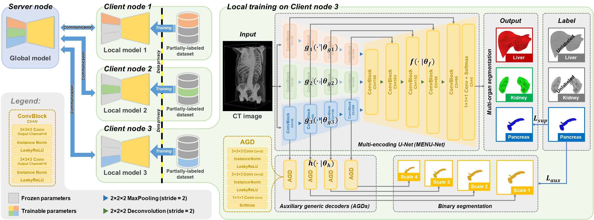

# Federated Multi-encoding U-Net (Fed-MENU)
Federated Multi-organ Segmentation with Inconsistent Labels

This is a python (PyTorch) implementation of **federated multi-encoding U-Net (Fed-MENU)** method for federated learning-based multi-organ segmentation with inconsistent labels proposed in our paper [**"Federated Multi-organ Segmentation with Inconsistent Labels"**](https://arxiv.org/abs/2206.07156) (under review).

## Abstract
Federated learning is an emerging paradigm allowing large-scale decentralized learning without sharing data across different data owners, which helps address the concern of data privacy in medical image analysis. However, the requirement for label consistency across clients by the existing methods largely narrows its application scope. In practice, each clinical site may only annotate certain organs of interest with partial or no overlap with other sites. Incorporating such partially labeled data into a unified federation is an unexplored problem with clinical significance and urgency. This work tackles the challenge by using a novel federated multi-encoding U-Net (Fed-MENU) method for multi-organ segmentation. In our method, a multi-encoding U-Net (MENU-Net) is proposed to extract organ-specific features through different encoding sub-networks. Each sub-network can be seen as an expert of a specific organ and trained for that client. Moreover, to encourage the organ-specific features extracted by different sub-networks to be informative and distinctive, we regularize the training of the MENU-Net by designing an auxiliary generic decoder (AGD). Extensive experiments on six public abdominal CT datasets show that our Fed-MENU method can effectively obtain a federated learning model using the partially labeled datasets with superior performance to other models trained by either localized or centralized learning methods. Source code is publicly available at [https://github.com/DIAL-RPI/Fed-MENU](https://github.com/DIAL-RPI/Fed-MENU).

## Method
### Scheme of Fed-MENU

## Data
In our paper, we conducted experiments using *six* public abdominal CT image datasets for *five-organ segmentation*, including *Liver*, *Kidney*, *Pancreas*, *Spleen*, and *Gallbladder*. The first five client datasets (Client #1~5) are randomly split into training/validation/testing sets with a fixed ratio of 60\%:10\%:30\%, respectively. The experimental results on the five testing sets are used for *in-federation* evaluation, which indicates the model performance when the testing data follows the same distribution as the training and validation data. For the BTCV dataset, we reserve it as an *out-of-federation* testing set, which is completely unseen to the model during training and validation.

Clients | Dataset | # of images (train/val/test) | Organ Labels Liver \| Kidney \| Pancreas \| Spleen \| Gallbladder
:--- | :--- | :---: | :---: 
In-federation Client #1 | [LiTS](https://competitions.codalab.org/competitions/17094) | 131 (79/13/39) | :white_check_mark: \| :no_entry: \| :no_entry: \| :no_entry: \| :no_entry:
In-federation Client #2 | [KiTS](https://kits19.grand-challenge.org/home/) | 210 (126/21/63) | :no_entry: \| :white_check_mark: \| :no_entry: \| :no_entry: \| :no_entry:
In-federation Client #3 | [MSD-Task07](http://medicaldecathlon.com/) | 281 (169/28/84) | :no_entry: \| :no_entry: \| :white_check_mark: \| :no_entry: \| :no_entry:
In-federation Client #4 | [MSD-Task09](http://medicaldecathlon.com/) | 41 (24/5/12) | :no_entry: \| :no_entry: \| :no_entry: \| :white_check_mark: \| :no_entry:
In-federation Client #5 | [AMOS](https://amos22.grand-challenge.org/) | 200 (120/20/60) | :white_check_mark: \| :white_check_mark: \| :white_check_mark: \| :white_check_mark: \| :white_check_mark:
Out-of-federation Client  | [BTCV](https://www.synapse.org/\#!Synapse:syn3193805/wiki/89480) | 30 (0/0/30) | :white_check_mark: \| :white_check_mark: \| :white_check_mark: \| :white_check_mark: \| :white_check_mark:

## Contact
You are welcome to contact us:  
  - [xux12@rpi.edu](mailto:xux12@rpi.edu)(Dr. Xuanang Xu)  
  - [superxuang@gmail.com](mailto:superxuang@gmail.com)(Dr. Xuanang Xu)
